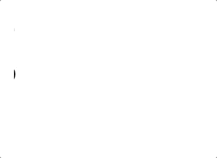

# `<mar-quee>`

This is a [web component](https://developer.mozilla.org/en-US/docs/Web/Web_Components) recreating the obsolete [`<marquee>`](https://developer.mozilla.org/en-US/docs/Web/HTML/Element/marquee) element.

----

Heavily inspired by [`<bg-sound>`](https://github.com/feross/bg-sound)
